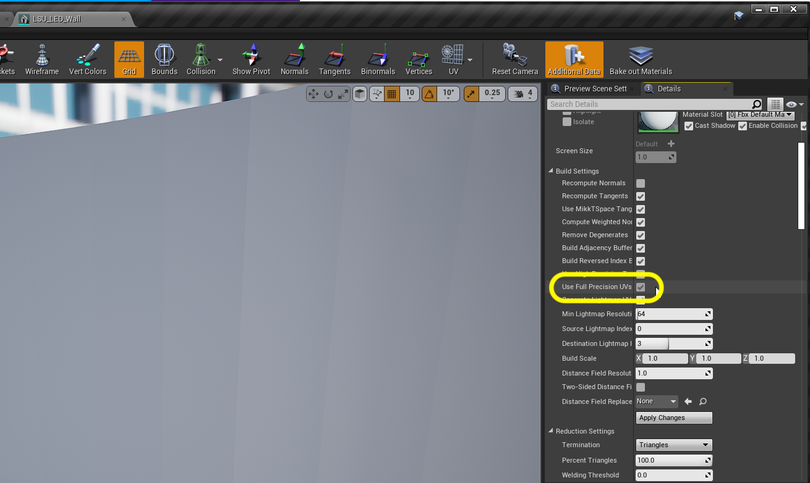
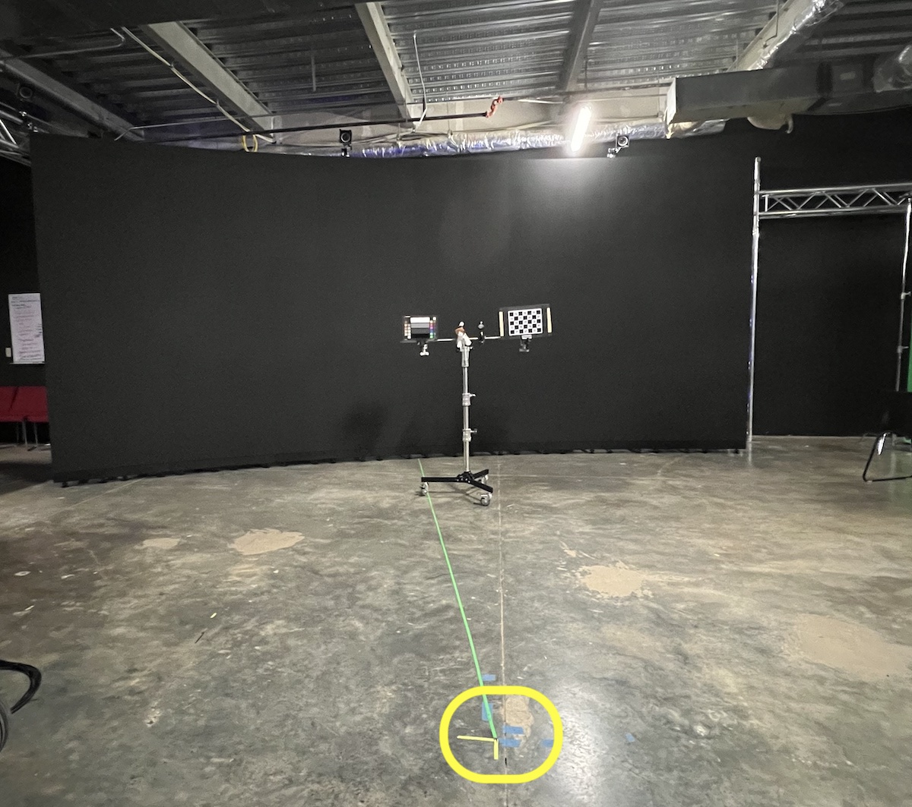
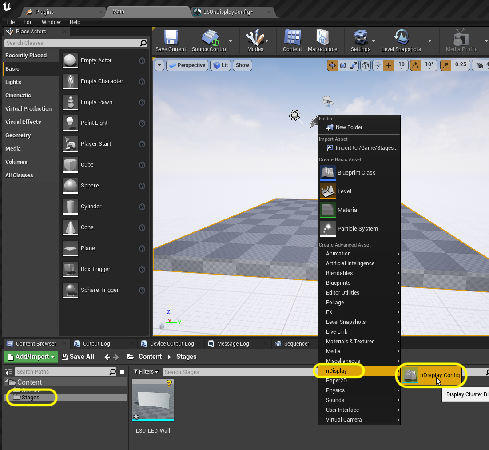
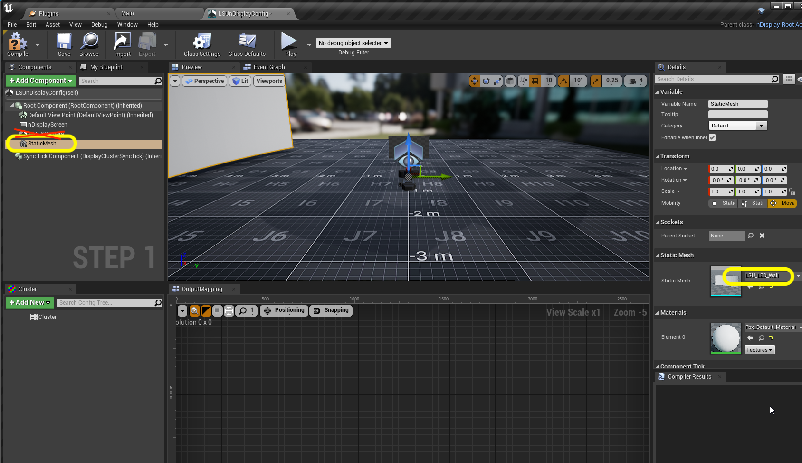
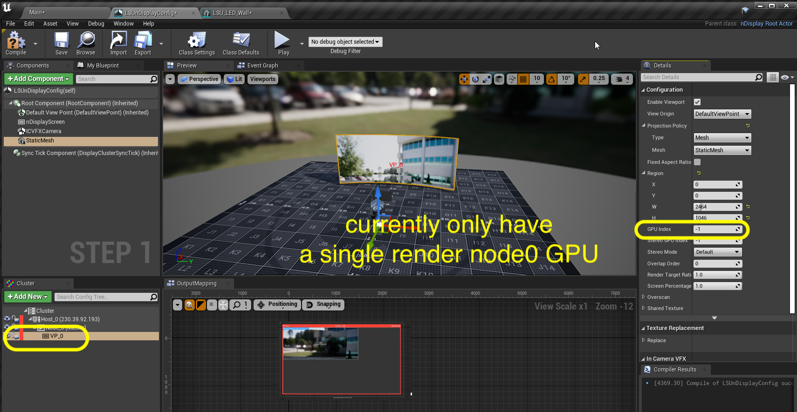

### nDisplay Config

[previous](../) • [home](../README.md#user-content-gms2-background-tiles--sprites---table-of-contents) • [next](../)

The heart of how the multi view system works in Unreal is through a plugin called nDisplay.  

 

---

##### `Step 1.`\|`BTS`|:small_blue_diamond:

First we need a 3-D representation of our wall in exact dimesions.  Download the static mesh [LSU_LED_Wall.FBX](images/LSU_LED_Wall.FBX).

##### `Step 2.`\|`BTS`|:small_blue_diamond: :small_blue_diamond: 

Drag the fbx you downloaded above into Unreal and accept the default settings for importing FBXs.

##### `Step 3.`\|`BTS`|:small_blue_diamond: :small_blue_diamond: :small_blue_diamond:

Open up the static mesh and it is an exact replica of our screen.  It contains two sets of UV's.  UV0 is just a 0 to 1 UV with the entire area filed.  The UV1 has our 6 x 14 grid of screens with the exact ratio of the wall.

##### `Step 4.`\|`BTS`|:small_blue_diamond: :small_blue_diamond: :small_blue_diamond: :small_blue_diamond:

The only chnage we need to make to this static mesh is to set **Use Full Precision UVs** to `true`. This uses greater floating point accuracy when calculating the UV's (I believe).

##### `Step 5.`\|`BTS`| :small_orange_diamond:

Now the only other special thing is that we have calibrated world 0,0 in our space about 10 feet in front of the center of our screen.  That is where we calibrate all of our 3-D systems.

##### `Step 6.`\|`BTS`| :small_orange_diamond: :small_blue_diamond:

Select the **Stages** folder. Press the green <kbd>Add/Import<\kbd> button and add a **nDisplay | nDisplay Config** file to the folder. Call this file `LSUnDisplayConfig`.

##### `Step 7.`\|`BTS`| :small_orange_diamond: :small_blue_diamond: :small_blue_diamond:

Open up the **LSUnDisplayConfig** file.  Press the green <kbd>Add Component</kbd> button and add an **ICVFX Camera** and a **Static Mesh**.

##### `Step 8.`\|`BTS`| :small_orange_diamond: :small_blue_diamond: :small_blue_diamond: :small_blue_diamond:

Click on the **StaticMesh** component and add the **LSU_LED_Wall** to the mesh in the **Details** panel.

##### `Step 9.`\|`BTS`| :small_orange_diamond: :small_blue_diamond: :small_blue_diamond: :small_blue_diamond: :small_blue_diamond:

Rotate the mesh so it is in the front of the stage.  The letters should be right side up if we are looking at the screen.

##### `Step 10.`\|`BTS`| :large_blue_diamond:

Since our resolution is less than a 4K screen we can use a single cluster node to power the screen.  Right click on **Cluster** and select **Add New Cluster Node**.

##### `Step 11.`\|`BTS`| :large_blue_diamond: :small_blue_diamond: 

You can leave the the node named **Node_0**). Make sure the **Parent** is set **Cluster**. The **ip** of our main machine is `230.39.92.193`.  **Enable Sound** and enable **Full Screen**.  Set the **W** of the screen to `2464` abd **H** of `1046`.  The Roe panels are pixels 176 pixels square per panel. We have a grid of 14 tiles wide by 6 tiles tall, thus giving us a resolution between 2K and 3K. Press the <kbd>Add</kbd> key.

##### `Step 12.`\|`BTS`| :large_blue_diamond: :small_blue_diamond: :small_blue_diamond: 

Now you can move the ICVFX camera around and the frustum should move as well.  We have a single GPU so we leave the **GPU Index** at -1 (which means a single GPU).

##### `Step 13.`\|`BTS`| :large_blue_diamond: :small_blue_diamond: :small_blue_diamond:  :small_blue_diamond: 

Add **CineCamera** actor to our **Main** level. Also add one copy of the **LSUnDisplayConfig** to the level as well. Make sure the **Z** is at `0` as we don't want to alter the ground position.  The setup can be moved to wherever in a future level you want to place it.  But we want the **Actor** ground level to be `0`, which is what we calibrated our camera to be starting at on **Z**.

##### `Step 14.`\|`BTS`| :large_blue_diamond: :small_blue_diamond: :small_blue_diamond: :small_blue_diamond:  :small_blue_diamond: 

Place the **CineCamera** actor in the **World Outliner** to be a child of **LSUnDisplayConfig**.  This way when we move the entire panel the cine camera moves with it.  Make sure the **CineCamera** is at `0,0,0` so we do not offset it.  The position will be given to the camera by the **OptiTrack** system. Name the camera `Red Komodo`.

##### `Step 15.`\|`BTS`| :large_blue_diamond: :small_orange_diamond: 

Go to the **LSUnDisplayConfig** and click on the **ICVX Camera** component and set the reference to the above **Red Komodo** camera.

##### `Step 16.`\|`BTS`| :large_blue_diamond: :small_orange_diamond:   :small_blue_diamond: 

Adjust the camera settings (focal length etc...).  

___

| [previous](../)| [home](../README.md#user-content-gms2-background-tiles--sprites---table-of-contents) | [next](../)|
|---|---|---|
