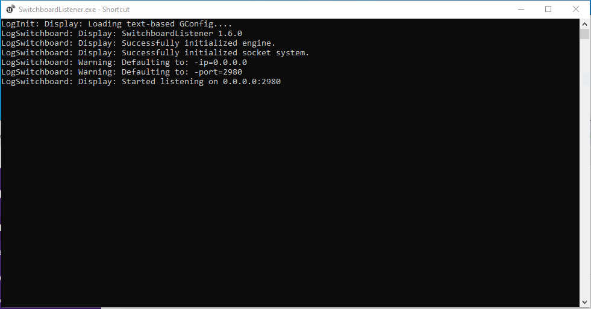
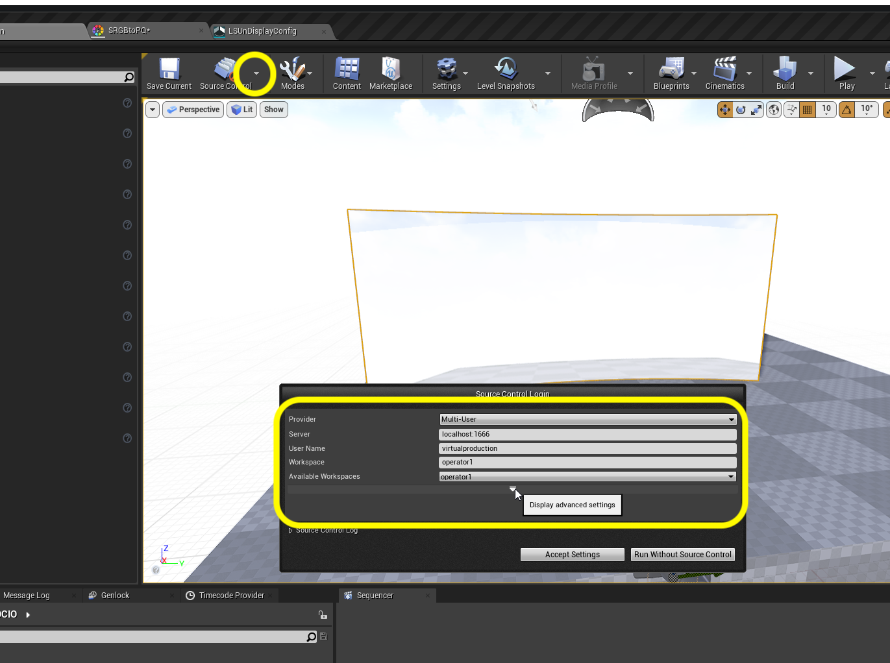
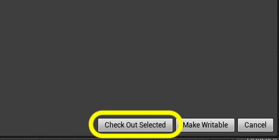

### Setting Up

[previous](../) • [home](../README.md#user-content-gms2-background-tiles--sprites---table-of-contents) • [next](../)

How to create an Unreal project from scratch in Unreal 4.27 for an in-camera virual production using LSU's equipment in their XR lab in room 1001 at the DMC. UE5 is still in Beta and has not ported over the virutal production capablities from UE4 yet.

 

---

##### `Step 1.`\|`BTS`|:small_blue_diamond:

Run the **Epic Games Launcher** and run the latest version of Unreal. Selet the **Film, Television, and Live Events** project category.  Press the <kbd>Next</kbd> button. Select a **Blank** template. Press the <kbd>Next</kbd> button.

##### `Step 2.`\|`BTS`|:small_blue_diamond: :small_blue_diamond: 

Select whether you want starter content or not and whether you want to enable or disable Raytracing.  Please remember that you need an RTX or similar GPU that supports RayTracing. Name your project and select the <kbd>Create Project</kbd> button.

##### `Step 3.`\|`BTS`|:small_blue_diamond: :small_blue_diamond: :small_blue_diamond:

Open up **Edit | Plugins** and in the **Virtual Reality** section turn off **SteamVR**, **Oculus** and the three **OpenXR** plugins.  Make sure you you have **nDisplay**, **nDisplay Support for Level Snapshots**, **Live Link**, **Live Link Over nDisplay**, **Multi-User Editing**, **Virutal Production Utilities**, **Media Framework Utilities**, **Blackmagic Media Player**. **Camera Calibration**, **Color Correct Regions**, **ICVFX**, **Level Snapshots**, **Live Link XR**, **Multi-User Editing**, **OpenColorIO**, **OSC**, **REmote Control API**, **Remote Control Web Interface**, **Switchboard**, **Time Data Monitor**.

You will need to restart the engine for this to take place.

##### `Step 4.`\|`BTS`|:small_blue_diamond: :small_blue_diamond: :small_blue_diamond: :small_blue_diamond:

Make sure **SwitchBoardListener is running**.  You can find it in **C:\Program Files\Epic Games\UE4_27\Engine\Binaries\Win64\SwitchboardListener.exe**.  Creata a shortcut for the desktop.  Run it.

##### `Step 5.`\|`BTS`| :small_orange_diamond:

Now you know if it working by making sure the terminal does not display any errors.  This looks good.

##### `Step 6.`\|`BTS`| :small_orange_diamond: :small_blue_diamond:

OK, we need to quit Unreal and set up a **Perforce Depot** (Project).  Either add to an existing Depot or create a new one in the **Admin** interface.  Use a normal **Local** depot. I called mine `Templates`. 

##### `Step 7.`\|`BTS`| :small_orange_diamond: :small_blue_diamond: :small_blue_diamond:

Now we need to add this new depot to the workspace (it does not know it is there). Right lick on the **Workspaces** in **P4V**. Right click on the workspace and select **Edit Workspace 'name of workspace'**. Then a window pops up and select **Include Tree**. Then select <kbd>Get Latest</kbd> button.

##### `Step 8.`\|`BTS`| :small_orange_diamond: :small_blue_diamond: :small_blue_diamond: :small_blue_diamond:

Create a directory in your workspace drive (mine is D:\perforce) with the exact same name including caps as the depot.  So I have a new folder called `Templates`.  I added a `readme.txt` file with the name of the project in it. I then opened **P4V** and selected the **Pending** tab and right clicked and selected a **New Pending Changelist**.

##### `Step 9.`\|`BTS`| :small_orange_diamond: :small_blue_diamond: :small_blue_diamond: :small_blue_diamond: :small_blue_diamond:

Now drag **readme.txt** to the changelist and submit it to the server. 

##### `Step 10.`\|`BTS`| :large_blue_diamond:

 Now you should see the new **Templates** depot in the **Depot** tab with the single text file.

##### `Step 11.`\|`BTS`| :large_blue_diamond: :small_blue_diamond: 

Now drag the entire Unreal folder you created into this new folder. Right click and include **Binaries, Config, Content, Source and MyProject folder**.  The Source folder is created to store source assets that are used in Unreal where all your raw art and audio files go.  Press the **Add** button and then **Submit** them to the repot.

##### `Step 12.`\|`BTS`| :large_blue_diamond: :small_blue_diamond: :small_blue_diamond: 

Now launch the game from **P4V** by double clicking an launching Unreal from the interface and not from the explorer or through Epics tools.

##### `Step 13.`\|`BTS`| :large_blue_diamond: :small_blue_diamond: :small_blue_diamond:  :small_blue_diamond: 

If all works well the source control will default to being connected.  Now if not just click on the arrow next to the <kbd>Source Control</kbd> button. Select **Perforce** and enter the **username** and **Workspace**.

##### `Step 14.`\|`BTS`| :large_blue_diamond: :small_blue_diamond: :small_blue_diamond: :small_blue_diamond:  :small_blue_diamond: 

Now you will create two folders `Stage` and `Scenes`.  The stage folder will have all the elements we need for our XR stage.  The scenes folder will contain all the scenes we are going to use in this project.  In our case we are creating one **Main** scene for our template.

##### `Step 15.`\|`BTS`| :large_blue_diamond: :small_orange_diamond: 

Now when you go to save, if you have not checked out the file you will be prompted to 
**Check out Selected**. NEVER select **Make Writable**.  This should never be used.  The only reason a file can't be checked out is if someone else is using it.  Just ask that person to check it back in so you can access it. In this case select **Check Out Selected** (any time you try and save an existing non-checked out asset).

___

| [previous](../)| [home](../README.md#user-content-gms2-background-tiles--sprites---table-of-contents) | [next](../ndisplay-config/README.md)|
|---|---|---|
